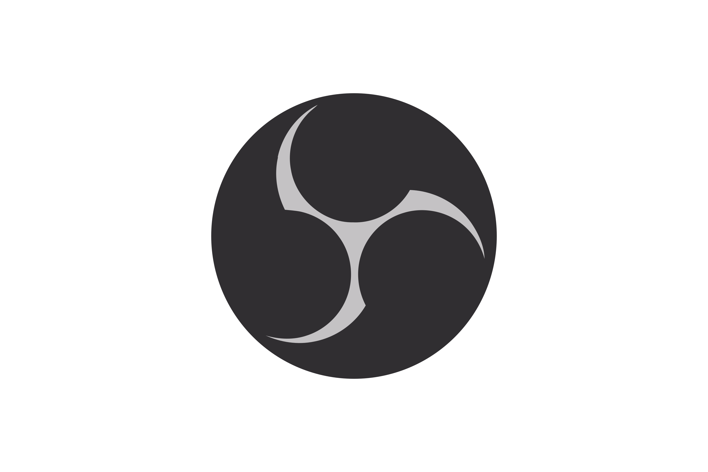

<!-- docs/README.MD is the home page -->

## BCE

Este repositório destina-se à matéria de Interação Humano-Computador da Universidade de Brasília. Possui o objetivo de analisar o site da BCE, aplicando conceitos aprendidos na discplina e propondo melhorias de usabilidade para a área destinada a empréstimo e devolução de livros.

## Equipe
 Foto | Nome | Email | GitHub |
 ---- | ---- | ----- | ------ |
 | Durval Carvalho de Souza	 | dudurval2@gmail.com | [@durvalcarvalho](https://github.com/durvalcarvalho) |
 | Geraldo Victor Alves Barbosa	 | geraldovictor@outlook.com | [@geraldovictor](https://github.com/geraldovictor) |
 | Isabella Carneiro Godinho de Morais Sa	 | Isabellacgmsa1@gmail.com | [@isabellacgmsa](https://github.com/isabellacgmsa) |
 | João Victor de Oliveira Matos	 | joao15victor08@gmail.com | [@joao15victor08](https://github.com/joao15victor08) |
 | Rafaella Oliveira de Faria Junqueira	 | 	rafaellafjunqueira@gmail.com | [@RafaellaJunqueira](https://github.com/RafaellaJunqueira) |

<h3> Ferramentas </h3>

|     |     | 
| :-: | :-: |
|  | O Github é uma excelente ferramenta para controle de versionamento e armazenamento dos arquivos de documentação. |
|  | Escolhemos o Telegram como ferramenta de comunicação, pois todos os integrantes do grupo já estão familiarizados com ela, além de ser possível criar enquetes o que facita a tomada de decisões. |
|  | Utilizamos o jitsi como ferramenta de chamadas e video chamadas, pois é uma ferramenta estável e de fácil acesso a todos os integrantes. |
|  | O Google Drive é uma ótima ferramenta para gerar documentos como: Excel, Word, PowerPoint e permite também o trabalho simultâneo e cooperativo de forma remota. Além de ser uma ferramentade de uso frequente por cada integrante grupo. |
|  | ZenHub é nativamente integrado ao GitHub, para a equipe serve como Kanbam, o diferencial é que podemos usar as issues como atividades a serem realizadas nos quadros de atividades o que melhora a produtividade. |
|  | OBS (Open Broadcast Software) é um programa de gravação de tela open source, uma das maiores vantagens se comparado com a própria gravação das video chamadas é a de ficar armazenado localmente ao invés de gravar e em seguida ter que baixar. |
|  | Camtasia é um programa de edição de vídeo que conta com excelentes ferramentas para o corte do video e de fácil manuseio, infelizmente é um programa pago, mas um dos integrantes da equipe tem o acesso ao mesmo. |
|  | Youtube atualmente é uma das ferramentas de streming de video mais populares do mundo, a divulgação das apresentações por meio dessa plataforma torna o acesso muito mais simples e fácil.  |

