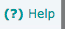

# Guia de Estilo

## Histórico de Versões
| Data       | Versão | Descrição            | Autor             |
|:----------:|:------:|:--------------------:|:-----------------:|
| 23/09/2020 | 0.1 | Criação do Documento | Isabella Carneiro |

## Introdução

Este guia de estilo define os padrões visuais utilizados pelo site da BCE e seu objetivo é auxiliar na avaliação e em futuras sugestões de melhorias no design do site.

## Logo

A logo da BCE é formada pela logo da Universidade de Brasília adicionada dos dizeres 'BCE' ao lado ou embaixo como podemos ver a seguir.

## Tipografia

A fonte utilizada no site é a 'Verdana'.

## Paleta de Cores

A cor de fundo do site está dividida entre a cor branca (#FFFFFF) e a cor cinza (#F1F3F2).
A cor do menu é o azul (#336C89).

## Padronização de Formas

## Padronização de Elementos da Interface

## Padronização dos Simbolos Usados

Os símbolos identificados no site foram para as seguintes funções:busca, ajuda, logout, ir para página inicial, salvar, procurar uma data e subir e descer nas opções.

## Opções de Acessibilidade

Há a opção de alto contraste para facilitar a leitura de pessoas com problemas de visão.

## Layout

O layout do site é definido por:

## Referências Bibliográficas

