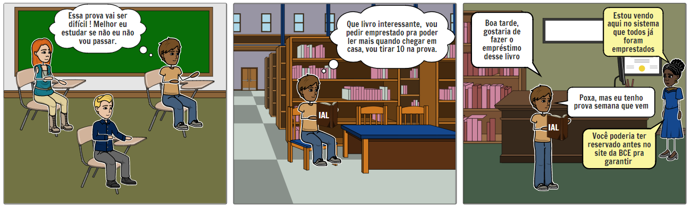
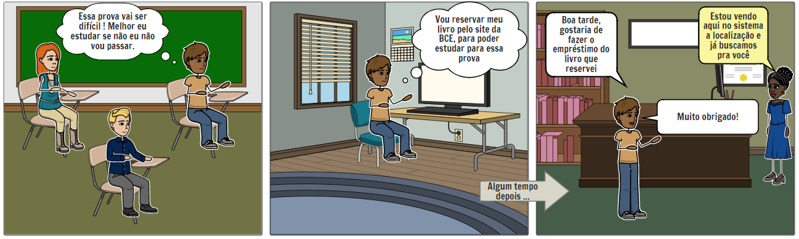
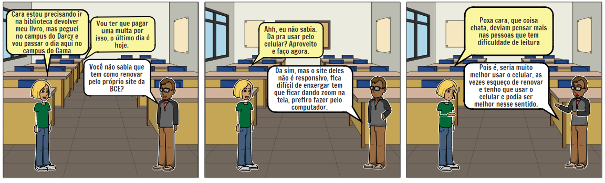
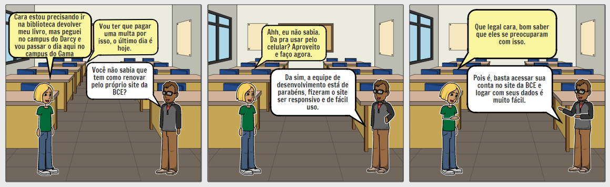

# StoryBoard

### Histórico de Versão
|    Data    | Versão | Descrição            | Autor(es)       |
| :--------: | :----: | :------------------: | :-------------: |
| 29.09.2020 |  0.1   | Criação do documento | Isabella Carneiro  |
| 29.09.2020 |  0.2   | Adição das ferramentas | Isabella Carneiro |
| 29.09.2020 |  0.3   | Adição da descrição | Isabella Carneiro  |
| 29.09.2020 |  0.4   | Adição do objetivo | Isabella Carneiro  |
| 20.10.2020 |  0.5   | Adição de storyboards | Geraldo Victor  |
| 21.10.2020 |  0.6   | Modificações nos tópicos: Introdução, Objetivo e Metodologia | Durval Carvalho  |
| 21.10.2020 |  0.7   | Adição do detalhamento textual do storyboard 1 | Durval Carvalho  |
| 22.10.2020 |  0.8   | Modificações e adições nos tópicos: Escolha das histórias, Resultados e Conclusão | Geraldo Victor  |

## 1. Introdução
Storyboard é um tipo de prototipação de baixa-fidelidade, geralmente utilizado em conjunto com cenários e histórias de usuários, onde será representado visualmente, com uso de histórias em quadrinhos, um usuário realizando uma tarefa ou um usuário em um cenário onde é preciso usar a aplicação.

O foco dos storyboards são as tarefas e os cenários, desse modo a parte estética fica em segundo plano.

O propósito de se fazer um storyboard é oferecer a pré-visualização das pessoas envolvidas, do ambiente / cenário que o sistema poderá ser usado, as interações que podem vim a ocorrer, e os passos necessários para realizar uma determinada tarefa.

## 2. Objetivo
Esse documento tem como objetivo documentar foi realizado a prototipação por meio de storyboard, além de apresentar os resultados obtidos.

## 3. Metodologia
Primeiramente foi analisado o [documento de Análise de Tarefa](/pages/ponto_de_controle_2/analise_tarefas) onde é detalhado as tarefas que os usuários realizam no sistema.

Após a identificação das tarefas, foi realizado uma introspecção para identificar possíveis cenários onde essas tarefas poderiam ser executadas. Nesssa introspecção foi definido as pessoas que estariam envolvidas no cenário, o ambiente, a tarefa, os passos envolvidos, a motivação para utilizar o sistema, e o resultado da história.

Para a elaboração do storyboard foram analisadas as seguintes opções de ferramentas:
- StoryboardThat
- Boords
  
Ambos são online e específicos para storyboards. O primeiro tem vários cenários, personagens e objetos que se pode utilizar, já o segundo necessita que os desenhos sejam feitos à mão.

Por esse motivo, optou-se por utilizar o _StoryboardThat_ e, se necessário, complementar com o uso do aplicativo Canva para a adição de objetos que não se encontram no banco de imagens da aplicação.

## 4. Escolha das Histórias
Nosso primeiro storyboard retrata a situação atual do site da BCE no diz respeito a responsividade do do mesmo, onde fica claro que o site da BCE não atende a essa demanda que é de suma importância,logo em seguida há uma representação do que seria o ideal, com esse storyboard o nosso objetivo é ilustrar uma tarefa descrita na análise de tarefas, sendo ela a de realizar o empréstimo de um livro.

No segundo storyboard o foco é diferente do anterior, nele temos um aluno que tinha o interesse em fazer o empréstimo de um livro do seu interesse, mas que infelizmente não estava disponível, então é orientado sobre a possibilidade de reserva de empréstimo. Já no segundo bloco de quadrinhos é ilustrado uma situação em que ele já conhece a possibilidade de reservar e decide fazer uso da mesma. Dessa forma nosso segundo storyboard tem o objetivo de retratar outra tarefa descrita na nossa análise de tarefas, sendo ela a de reservar um empréstimo.

## 5. Resultados

Para criação de um storyboard é extremamente importante definirmos qual cobertura o mesmo deve proporcionar, a seguir os storyboard terão suas atividades e tarefas descritas, para que assim o haja uma descrição mais detalhada acerca dessa cobertura.

### Tabela de cobertura do primeiro storyboard 
| Atividade | Tarefa |
| :-:       | :-   |
| Setting / Preparo | **1. Definição das pessoas envolvidas:** Aluno Rafael, Bibliotecária Júlia   **2. Definição do ambiente da história:** Faculdade (sala de aula, biblioteca).  **3. Definição de qual tarefa será abordada:** Realizar o empréstimo de um livro. |
| Sequence / Sequência | **1. Definição de quais passos estão envolvidos para realização da tarefa:** Acessar o site da BCE, realizar o login, reservar um livro.  **2. Definição do que leva a pessoa a usar a aplicação:** Reservar um livro pra conseguir com mais facilidade o seu empréstimo.  **3. Definição de qual (e como) a tarefa será ilustrada:** Fazer o empréstimo do livro, será ilustrado um aluno precisando fazer o empréstimo do livro para estudar para uma prova que se aproxima. |
| Satisfaction / Satisfação | **1. Definição da motivação principal da pessoa que usa a aplicação:** Fazer o empréstimo de livros.  **2. Definição das realizações que a aplicação permite:** Não ter que ser surpreendido pela falta do livro desejado causa uma sensação de segurança  **3. Definição das necessidades que a aplicação se proprõe a sanar:** Necessidade de garantir o empréstimo de um livro para aqueles que desejam fazer o empréstimo do mesmo. |

### Ilustração de uma situação em que o usuário precisa realizar a tarefa de fazer o empréstimo

* Como pode acontecer: 

  <figcaption align='center'>
    <b>Figura 1: StoryBoard 1</b>
     
    <small>Fonte: Autor</small>
  </figcaption>

 

* Como poderia ter sido:

  <figcaption align='center'>
    <b>Figura 2: StoryBoard 1</b>
     
    <small>Fonte: Autor</small>
  </figcaption>

 

### Tabela de cobertura do segundo storyboard 
| Atividade | Tarefa |
| :-:       | :-   |
| Setting / Preparo | **1. Definição das pessoas envolvidas:** Aluno Alberto e Aluno Bernardo   **2. Definição do ambiente da história:** Faculdade (sala de aula).  **3. Definição de qual tarefa será abordada:** Realizar a renovação de um empréstimo. |
| Sequence / Sequência | **1. Definição de quais passos estão envolvidos para realização da tarefa:** Acessar o site da BCE, realizar o login, renovar um empréstimo.  **2. Definição do que leva a pessoa a usar a aplicação:** Realizar a renovação de um empréstimo sem ter que ir fisicamente ao local onde o livro foi retirado.  **3. Definição de qual (e como) a tarefa será ilustrada:** Fazer a renovação de um empréstimo, será ilustrado um aluno precisando fazer a renovação de um empréstimo online, pois ele não pode ir fisicamente ao local de onde o livro foi emprestado. |
| Satisfaction / Satisfação | **1. Definição da motivação principal da pessoa que usa a aplicação:** Fazer a renovação do empréstimo sem ter que ir ao local de onde foi emprestado.  **2. Definição das realizações que a aplicação permite:** Conforto de não ter que se deslocar pra realizar uma tarefa simples quando não tem tempo para essa tarefa, além de tranquilidade com o fato de não ter que pagar multa.  **3. Definição das necessidades que a aplicação se proprõe a sanar:** Necessidade de deslocamento que muitas vezes pode ser um grande empecilho para aqueles que precisam renovar um empréstimo. |

## Ilustração de uma situação em que o usuário precisa realizar a tarefa de renovar um empréstimo

* Como é atualmente:

  <figcaption align='center'>
    <b>Figura 3: StoryBoard 2</b>
     
    <small>Fonte: Autor</small>
  </figcaption>

 

* Como poderia ser:

  <figcaption align='center'>
    <b>Figura 4: StoryBoard 2</b>
     
    <small>Fonte: Autor</small>
  </figcaption>

 

## 6. Conclusão

Como foi visto nesse documento o storyboard é uma ferramenta muito útil para exemplificar como as tarefas da aplicação podem ser realizadas, quais necessidade o ela atende, a quem se destina, quais motivações levam o usuário a utilizá-la, além de muitos outros pontos positivos que aqui foram destacadas.

## 7. Referências

- Sommerville, Ian. Engenharia de Software. 9a Edição. Pearson.
- BARBOSA, Simone; DINIZ, Bruno. **Interação Humano-Computador**, Editora Elsevier, Rio de Janeiro, 2010.