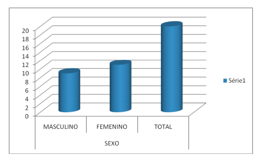

# Relatório de Pesquisa N° 1

| | |
|:-:| :-: |
| **Título:** | A Utilização dos Recursos Multimídias para a Busca da Informação na Biblioteca Central da Universidade de Brasília (BCE) |
| **Autor:** | Wesclei Batista Santos |
| **Tipo:** | Monografia apresentada a Faculdade de Ciência da Informação (FCI) como requisito parcial para a obtenção do título de Bacharel em Biblioteconomia |

 

### **Objetivo da pesquisa**

Analisar a possibilidade de uso dos recursos multimídias na busca de informação pelos usuários de multimeios na Biblioteca Central da UnB. A utilização dos recursos multimídias por parte dos usuários e professores da Faculdade de Ciência da Informação. 

### **Metodologia**

Os métodos abordados na pesquisa foram questionários e entrevistas não estruturadas aplicados a usuários do multimeios da BCE e professores da FCI respectivamente. Os dados analisados subsidiaram o grau de conhecimento, uso e o cadastramento dos recursos multimídias (streaming media) pelos usuários do multimeios, o nível de concordância da implantação desses recursos na seção de multimeios, a utilização de uma videoteca digital na seção de multimeios e o bibliotecário como desenvolvedor de coleção e disseminador de materiais audiovisuais a partir dos recursos multimídias.

### **Amostragem**

No gráfico, a seguir, os cursos dos respondentes que participaram da pesquisa. Pode-se perceber uma variedade significativa de cursos que podem utilizar a seção de multimeios.

  

No gráfico abaixo, é mostrado dados demográficos: sexo e faixa etária do multimeios da BCE. No total, foram entrevistados nove homens e onze mulheres.

  

  

#### Pergunta 1:
Pergunta objetiva de alternativas podendo ser assinalado somente uma alternativa, onde foi perguntado se os entrevistados conheciam alguma ferramenta de streming media e se utilizavam a mesma.

* 85% Conhecem e usam
* 5% Conheciam e não usavam
* 10% Não conheciam

  

#### Pergunta 2:
Pergunta objetiva podendo assinalar uma ou várias alternativas, onde foi perguntado se os entrevistados em quais das ferramentas de streming media eles tinham cadastro.

* 90% Tinham cadastro no Youtube
* 5% Tinham cadastro no Flickr
* 10% Tinham cadastro no SlideShare
* 5% Tinham cadastro no PodCasting
* 15% Tinham cadastro em outras

  

#### Pergunta 3:
Pergunta objetiva de alternativas podendo ser assinalado somente uma alternativa, onde foi perguntado se os entrevistados usuariam alguma ferramenta de streming media na seção de multimeios da BCE.

* 80% Usariam e acham útil
* 20% Talvez usuaria e acham útil

  

#### Pergunta 4:
Pergunta objetiva de alternativas podendo ser assinalado somente uma alternativa, onde foi perguntado se os entrevistados concordavam com a implantação de ferramentas de streming media.

* 70% Concordaram totalmente
* 25% Concordaram
* 5% Não concordam nem discordam

  

#### Pergunta 5:
Pergunta objetiva de alternativas podendo ser assinalado somente uma alternativa, onde foi perguntado se os entrevistados usariam e se acham que seria útil uma videoteca digital na seção dos multimeios.

* 90% Usariam e acham que seria útil
* 10% Talvez usariam e acham que seria útil

  

## Conclusões

Foi visto nesta pesquisa a possibilidade de utilização de recursos multimídias. O uso de uma videoteca digital na Seção de Multimeios da BCE é possível e útil. A possibilidade de busca e acesso da informação para usuários é viável. Nas respostas obtidas, os usuários concordaram com a utilização das novas tecnologias (streaming media) e a possibilidade de uma implantação de uma videoteca digital.

## REFERÊNCIAS

Santos, Wesclei Batista Santos. A Utilização dos Recursos Multimídias para a Busca da Informação na Biblioteca Central da Universidade de Brasília (BCE) - 2011.