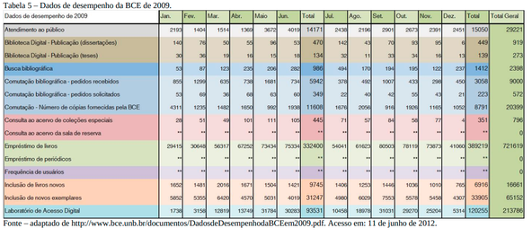
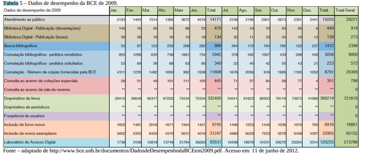

# Relatório de Pesquisa N° 16

| | |
|:-:| :-: |
| **Título:** | Análise do espaço virtual da biblioteca central da
universidade de brasília: marketing como referencial teóricometodológico |
| **Autor:** | Thiago Teixeira Barbosa |
| **Tipo:** | Monografia de obtenção de bacharel em Biblioteconomia |
___
 

### **Objetivo da pesquisa**

Analisa a utilização do Marketing no espaço virtual da Biblioteca Central da Universidade de Brasília (BCE/UnB), buscando compreender sua aplicação como um instrumento teórico-metodológico utilizado para maximizar os produtos e serviços oferecidos pela instituição e ao mesmo tempo tornar fiel o seu público e atrair novos usuários. Porém para esse relatório o foco será em mostrar alguns dados coletados dessa pesquisa que são relevantes para o escopo do projeto.

### **Metodologia**

Pesquisa exploratória com a abordagem de coleta de dados quantitativa. 

### **Amostragem**

Esse relatório leva em consideração dados fornecidos pela própria BCE.

#### Pergunta 1:
O desempenho da BCE visto no sentido de website teve alguma melhora no período compreendido entre 2007-2009 nos critérios destacados pelas tabelas no total geral?

* Atendimento ao público:
  - Houve um aumento de 9340 para 28221 equivalente a aproximadamente 202%;

* Biblioteca Digital - Publicação (Dissertações):
  - Houve um aumento de 1066 para 1384 equivalente a aproximadamente 29%;

* Biblioteca Digital - Publicação (Teses):
  - Houve um aumento de 278 para 417 equivalente a aproximadamente 50%;

* Busca bibliográfica:
  - Houve um aumento de 2125 para 2398 equivalente a aproximadamente 12%

* Comutação bibliográfica pedidos recebidos:
  - Houve uma diminuição de 1342 para 9000 equivalente a aproximadamente 570%;

* Comutação bibliográfica pedidos solicitados:
  - Houve uma diminuição de 729 para 572 equivalente a aproximadamente 27%;

* Comutação - Número de cópias fornecidas pela BCE:
  - Houve uma diminuição de 28020 para 20399 equivalente a aproximadamente 37%;

* Consulta ao acervo de Coleções Especiais:
  - Houve uma diminuição de 1014 para 806 equivalente a aproximadamente 25%;

* Empréstimos de livros:
  - Houve um aumento de 320341 para  721619 equivalente a aproximadamente 125%;

* Frequencia de usuários:
  - Houve uma diminuição de 771558 para 150679 de 2007 para 2008 equivalente a aproximadamente 412%, já em 2009 não foi registrado na tabela esse dado;

* Inclusão de títulos novos ao acervo:
  - Houve uma diminuição de 11914 para 15661 equivalente a aproximadamente 31%;

* Inclusão de novos exemplares:
  - Houve um aumento de 64949 para 65143 equivalente a aproximadamente 0,29%;

* Laboratório de Acesso Digital:
  - Houve um aumento de 40256 para 213786 equivalente a aproximadamente 431%;

  

  

  

#### Pergunta 2:
Como esses dados do desempenho da BCE pode refletir na estatística de empréstimo dos livros?

* Apesar de existirem períodos de queda (provalmente por conta de recesso estudantil) é fácil notar que existe uma tendência crescente de empréstimos de livros, como é destacado no gráfico 14.

  

  

  

  

  

  

## Conclusões

Através da análise dos dados foi possível observar que em suma a BCE durante esse período na maioria dos critérios melhorou seu desempenho, porém é necessário ressaltar em alguns ela perdeu desempenho, o que pode causar desinteresse nos usuários caso não seja encontrado algo que os auxiliem para sua pesquisa. Dentro do escopo do projeto de IHC podemos destacar que o laboratório de acesso digital teve melhora de desempenho considerável e que isso reflete diretamente na importancia que um sistemas digitais tem  e que tem ganhado cada vez mais visibilidade, portanto, tornar esses sistemas mais agradáveis aos seus usuários é um processo imprescindível. 

## REFERÊNCIAS

Barbosa, Thiago Teixeira Barbosa Análise do espaço virtual da biblioteca central da
universidade de brasília: marketing como referencial teóricometodológico – 2012.