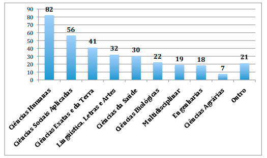
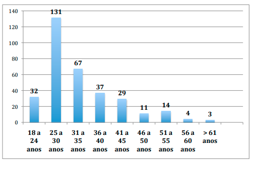
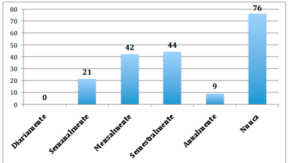
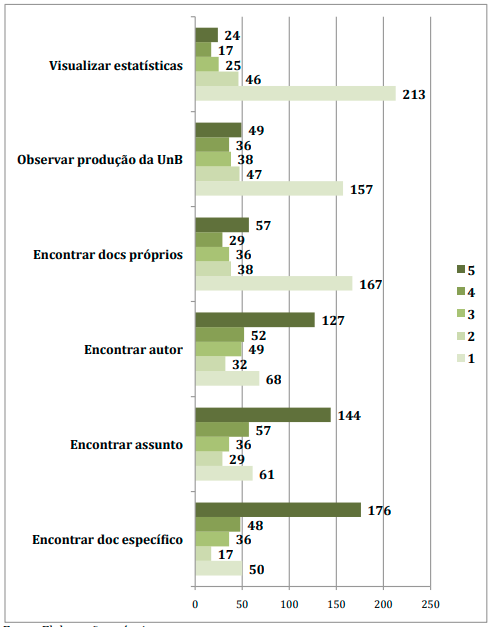
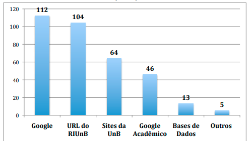

# Relatório de Pesquisa N° 17

| | |
|:-:| :-: |
| **Título:** | Avaliação da usabilidade na interação e recuperação da informação dos usuários pós graduandos no repositório institucional da universidade de brasília |
| **Autor:** | Luísa Chaves Café |
| **Tipo:** | Dissertação de mestrado apresentada ao Programa de Pós graduação em Ciência da Informação da UnB |
___
 

### **Objetivo da pesquisa**

Apresenta pesquisa sobre a usabilidade na recuperação da informação no Repositório Institucional da Universidade de Brasília (RIUnB). O objetivo geral da pesquisa é descrever a interação entre usuários pós graduandos e o RIUnB durante o processo de recuperação da informação.

### **Metodologia**

Esta pesquisa é considerada do tipo descritiva, pois neste estudo será realizada descrição das características do fenômeno de interação dos usuários de repositórios com as interfaces destes sistemas. A pesquisa descritiva envolve o uso de técnicas padronizadas para coleta de dados como a observação sistemática (KAUARK; MANHÃES; MEDEIROS, 2010). Walliman (2001) também demonstra a observação como um meio de coleta de dados das pesquisas descritivas.

### **Amostragem**

Para o primeiro gráfico 86 foram consultados no total.

  

  

  

#### Pergunta 1:
Pretendia saber a quais eram os repositórios mais de acesso aberto utilizados

* 75% DSpace
* 8% Desconhecido
* 4% SciELO
* 3% TEDE
* 2% Drupal
* 1% Corisco
* 1% ETD-db
* 1% Maswelll
* 3% Outros

  

#### Pergunta 2:
Pretendia avaliar o uso das ferramentas de pesquisa na internet

* Catálogos online: a maioria votou na escala 1, ou seja, pouco uso.
* Páginas institucionais: a maioria votou na escala 3, ou seja, uso mediano.
* Bibliotecas digitais: a maioria votou na escala 4, ou seja, uso constante
* Base de dados: a maioria votou na escala 1, ou seja, pouco uso.
* Respositórios: a maioria votou na escala 1, ou seja, pouco uso.
* Revistas: a maioria votou 5, ou seja, uso elevado.
* Portal capes:  maioria votou 5, ou seja, uso elevado.
* Google acadêmico: maioria votou 5, ou seja, uso elevado.
* Google: maioria votou 5, ou seja, uso elevado.

  

#### Pergunta 3:
Pretendia saber a qual era a frequencia de uso do RIUnB

* 39,58% Nunca
* 4,68% Anualmente
* 22,91% Semestralmente
* 21,27% Mensalmente
* 10,93% Semanalmente

  

#### Pergunta 4:
Pretendia saber a quais eram os motivos de uso do RIUnB

Pretendia avaliar o uso das ferramentas de pesquisa na internet

* Visualizar estatísticas: a maioria votou na escala 1, ou seja, pouco por esse motivo.
* Observar produção da UnB: a maioria votou na escala 1, ou seja, pouco por esse motivo.
* Encontrar doc próprios: a maioria votou na escala 1, ou seja, pouco por esse motivo.
* Encontrar o autor: a maioria votou 5, ou seja, muito por esse motivo.
* Encontrar assunto: a maioria votou 5, ou seja, muito por esse motivo.
* Encontrar doc específicio: a maioria votou 5, ou seja, muito por esse motivo.

  

#### Pergunta 5:
Pretendia saber a quais eram os métodos de acesso ao RIUnB

* 55,44% Google
* 51,48% URL do RIUnB
* 31,68% Sites da UnB
* 22,77% Google Acadêmico
* 6,43% Base de dados
* 2,47% Outros

  

## Conclusões

Para identificar o perfil dos usuários, foram coletados dados a partir dos questionários enviado aos estudantes de pós graduação. De acordo com as observações, os estudantes de pós graduação da Universidade utilizam a Internet com grande frequência para fazer pesquisas acadêmicas, especificamente bases de dados, o Google acadêmico, portal de periódicos da Capes, entre outros. Constatou-se que os estudantes no geral utilizam o serviço apenas ocasionalmente ou não utilizam. O que demonstra que o repositório ainda não constitui uma preferência de serviço de busca. Quando consultam o repositório, o fazem geralmente para buscar um documento específico e ocasionalmente fazer uma busca por assunto ou autor. Como foi observado que os usuários geralmente acessam o repositório pelo Google, e utilizam muito este serviço para fazer pesquisas acadêmicas, talvez fosse interessante trabalhar a interoperabilidade do repositório, para que os documentos do RIUnB sejam mais visíveis à comunidade científica pelo Google ou Google acadêmico. Também seria positivo aos estudantes da UnB que o RIUnB fosse mais divulgado a partir de diferentes estratégias. O treinamento do repositório oferecido pela Biblioteca da UnB já constitui uma interessante forma de divulgar o sistema assim como uma boa prática de ensino de uso do repositório.

## REFERÊNCIAS

Café, Luísa Chaves Café. Avaliação da usabilidade na interação e recuperação da informação dos usuários pós graduandos no repositório institucional da universidade de brasília. – 2016.
