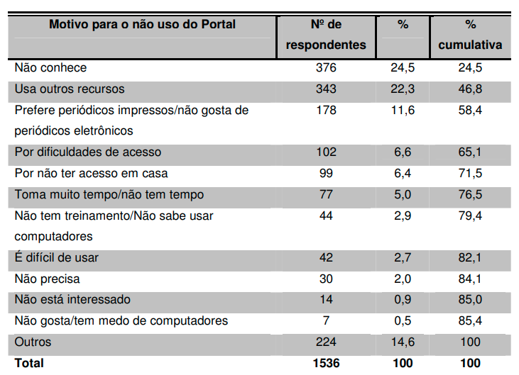
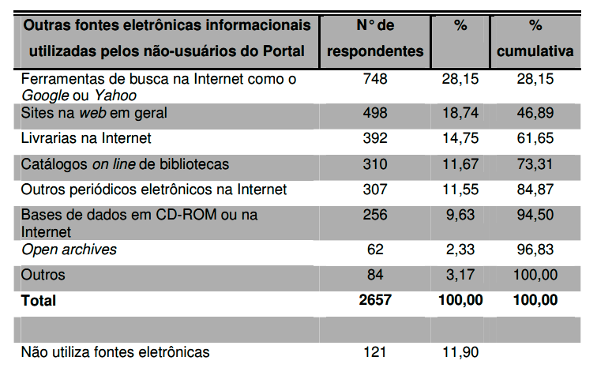
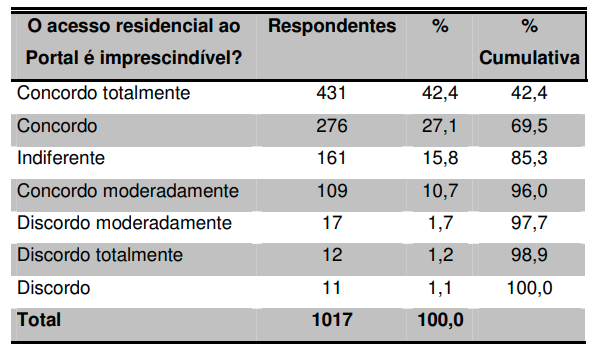

# Relatório de Pesquisa N° 19

| | |
|:-:| :-: |
| **Título:** | Portal Periódicos Capes: estudo dos não-usuários docentes das IFES brasileiras |
| **Autor:** | Wesley Rodrigo Fernandes |
| **Tipo:** | Dissertação de obtenção de Pós-Graduação em Ciência da Informação |
___
 

### **Objetivo da pesquisa**

A presente pesquisa teve por objetivo compreender o fenômeno da não utilização do Portal de Periódicos Capes por docentes das Instituições Federais de Ensino Superior (IFES) brasileiras.

### **Metodologia**

A metodologia utilizada foi quantitativa com coleta de alguns dados qualitativos. A pesquisa desenvolvida foi exploratória e descritiva. O estudo verificou através do teste do qui-quadrado, quais variáveis do primeiro questionário estavam relacionadas com o uso ou não uso do Portal.

### **Amostragem**

Os dados analisados foram provenientes de dois questionários: o primeiro, respondido por 6689 docentes, coletou dados sobre as características pessoais e profissionais dessa amostra. O segundo questionário, enviado aos respondentes que se declararam não-usuários do Portal no primeiro questionário, teve 1017 respondentes. Em ambos os questionários, os respondentes estavam distribuídos por 17 universidades federais brasileiras das cinco regiões brasileiras.

### Resultados

Professores que declararam não terem nenhum conhecimento com o uso da Internet tiveram um percentual de não uso do Portal de 75%, professores que se declararam iniciantes tiveram um percentual de não uso de 54,5% e o percentual vai diminuindo gradativamente até chegarmos aos usuários que se declaram experts com um percentual de não uso de apenas 6,7%.

  

De acordo com a pesquisa, os professores universitários brasileiros utilizam a Internet principalmente para realizar pesquisas acadêmicas, onde 6522 dos 6689
professores pesquisados assinalaram essa opção, isto é (97,5%).

  

Os cinco principais motivos para o não uso do Portal, que respondem por 71,5% das opções assinalados pelos não-usuários do
Portal foram respectivamente: o desconhecimento do Portal (24,5%); a utilização de outros recursos (22,3%); a preferência por periódicos impressos (11,6%); a
dificuldade de acesso (6,6%) e a falta de acesso em casa (6,4%). 

  

Os não-usuários responderam que utilizam alguma fonte eletrônica informacional em 2.657 casos e que não utilizavam nenhuma fontes eletrônica outras 121 vezes, o que representa apenas 11,90% dos 1017 não-usuários respondentes. As quatro fontes eletrônicas informacionais mais utilizadas, responsáveis por 73,31% das fontes eletrônicas informacionais utilizadas pelos não-usuários foram respectivamente: ferramentas de busca na Internet como o Google ou Yahoo (28,15%); sites na web em geral (18,74%); livrarias na Internet (14,75%); catálogos on line de bibliotecas (11,67%).

  

Na sexta pergunta foi questionado aos não-usuários do Portal se a possibilidade de acesso ao Portal Capes a partir de casa era imprescindível para
eles se tornarem usuários do Portal. De acordo com a TAB. 51, pode-se concluir que 42,4% dos não-usuários concordaram totalmente que o acesso residencial ao Portal era imprescindível. Outros 37,8% também concordaram de forma mais moderada que o acesso residencial era imprescindível, o que totalizou uma concordância de
80,2% dos não-usuários. Para outros 15,8% esse acesso residencial não modificaria em nada este não uso e 4% dos não-usuários discordavam que o acesso
residencial poderia modificar esta situação de não uso.

  

## Conclusões

Os dados revelaram que 16,1% dos docentes respondentes não utilizam o Portal. Esses docentes pertenciam principalmente às áreas de linguística, letras e artes (39%), ciências sociais aplicadas (28,3%) e ciências humanas (24,3%). Já por outro lado os docentes que mais utilizam o Portal pertenciam respectivamente às áreas de ciências biológicas (97,7%), ciências exatas e da terra (90,8%) e ciências da saúde (88,4%).

Os dados indicaram ainda que o não conhecimento do Portal (24,5%), a utilização de outros recursos (22,3%), a preferência por periódicos impressos (11,6%), a dificuldade de acesso (6,6%) e o não acesso residencial ao Portal (6,4%) são os cinco principais motivos para o não uso do Portal sendo responsáveis por mais de 70% das
respostas. 

Por fim foram levantadas as principais fontes eletrônicas informacionais utilizadas pelos não-usuários do Portal que constituem mais de 70% das fontes relatadas, estas fontes foram respectivamente as ferramentas de busca na Internet (28,15%), os sites na web em geral (18,74%), as livrarias na Internet (14,75%) e os catálogos on line de bibliotecas (11,67%). 

## REFERÊNCIAS

Fernandes, Wesley Rodrigo. Portal Periódicos Capes: estudo dos não-usuários docentes das IFES brasileiras / Wesley Rodrigo Fernandes. – 2012.
