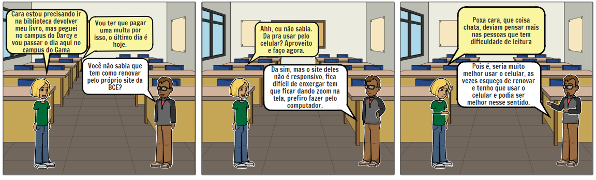
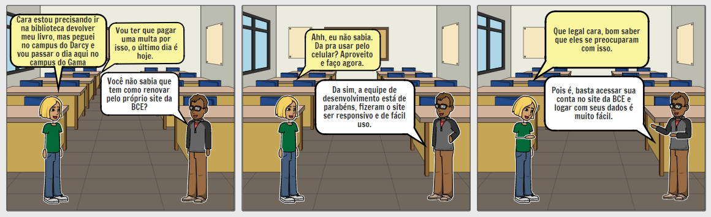

# StoryBoard

## Histórico de Versão
|    Data    | Versão | Descrição            | Autor(es)       |
| :--------: | :----: | :------------------: | :-------------: |
| 29.09.2020 |  0.1   | Criação do documento | Isabella Carneiro  |
| 29.09.2020 |  0.2   | Adição das ferramentas | Isabella Carneiro |
| 29.09.2020 |  0.3   | Adição da descrição | Isabella Carneiro  |
| 29.09.2020 |  0.4   | Adição do objetivo | Isabella Carneiro  |
| 20.10.2020 |  0.5   | Adição de storyboards | Geraldo Victor  |

## 1. Descrição

É uma técnica para visualização de cenários particulares do usuário de forma esquematizada.

Essa técnica é formada por uma série de telas mostrando como o usuário pode progredir em uma tarefa e com ela pode se explorar diversos cenários.

## 2. Objetivo

O storyboard tem como objetivo validar os cenários representados no documento, além de permitir uma prototipação não operacional.

## 3. Escolha da Ferramenta

 Para a elaboração do storyboard foram analisadas as seguintes opções de ferramentas:

- StoryboardThat
- Boords

Ambos são online e específicos para storyboards. O primeiro tem vários cenários, personagens e objetos que se pode utilizar, já o segundo necessita que os desenhos sejam feitos à mão.

Por esse motivo, optou-se por utilizar o primeiro e, se necessário, complementar com o uso do aplicativo Canva para a adição de objetos que não se encontram no banco de imagens da aplicação.

## 4. Escolha das Histórias

Na primeira história é ilustrado o descontentamento quanto a falta de responsividade em dispositivos móveis no site da BCE. Já na segunda história é ilustrado como deveria ser e o quanto poderia agregar aos usuários que tem dificuldade de leitura.

## 5. Resultados

## 6. Conclusão
Como foi ilustrado acima o site da BCE não é responsivo o que acarreta na desistência do uso do mesmo em dispositivos móveis, seria de suma importância que ele fosse, tendo em vista a facilidade de acesso que alunos têm atualmente a dispositivos móveis.

## 7. Referências
- Sommerville, Ian. Engenharia de Software. 9a Edic¸ao. Pearson.
- BARBOSA, Simone; DINIZ, Bruno. **Interação Humano-Computador**, Editora Elsevier, Rio de Janeiro, 2010.