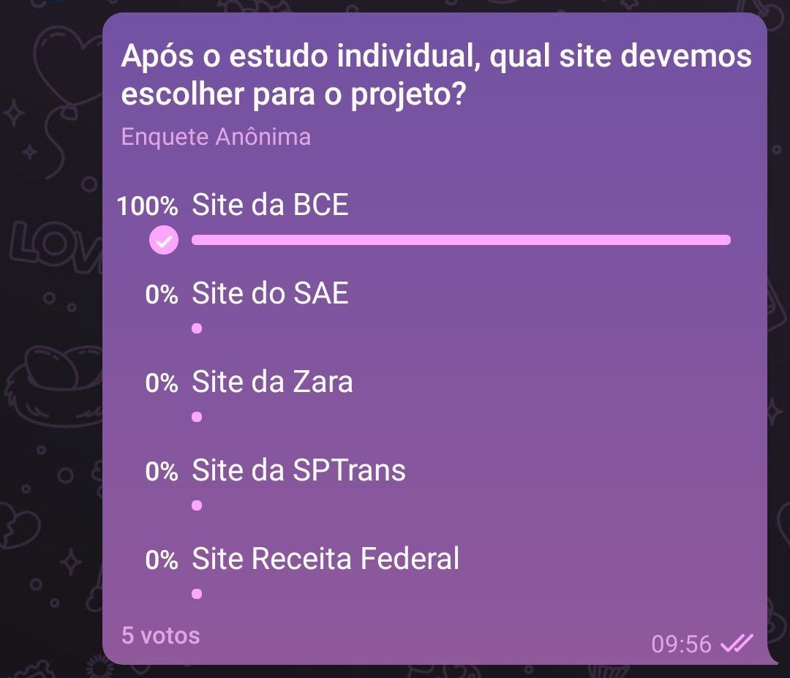

# Reunião

Data: 2 de setembro de 2020, das 9:40 as 10:00

### Participantes:
- Durval (@durvalcarvalho)
- Geraldo (@geraldovictor)
- Isabella (@isabellacgmsa)
- Joao Victor (@joao15victor08)
- Rafaella (@RafaellaJunqueira)

### Objetivo:
1. Decidir qual dos sites analisados individualmente tem maior potencial para escopo do trabalho em grupo.

### Conclusão

Após a divulgação das análises individuais, foi realizado uma enquete anônima utilizando o aplicativo telegram e foi decido por unanimidade a escolha do **site da BCE** para o escopo do trabalho em grupo.

<h1 align="center">
   
    
   
</h1>

Os pontos chaves que levaram a escolha desse site foi:
* Facilidade de encontrar usuários do sistema
* Ampla referência bibliográfica sobre os sistemas da BCE
* Existência de problemas graves de usabilidade no site da BCE
