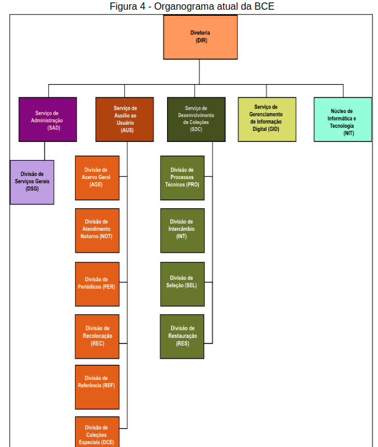
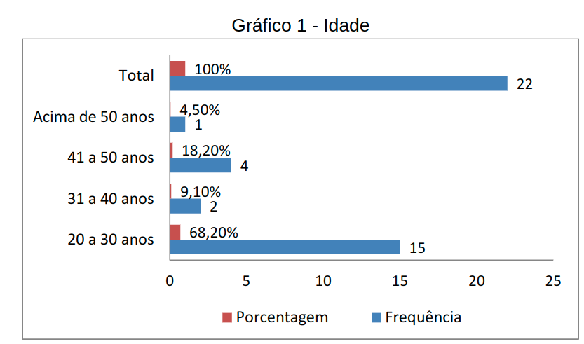
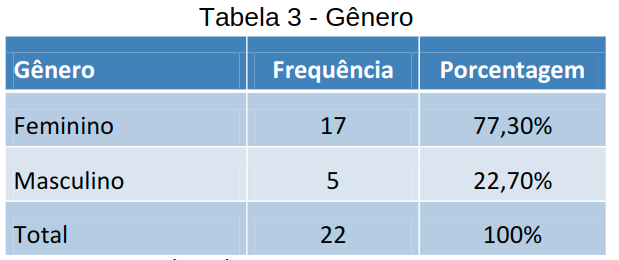
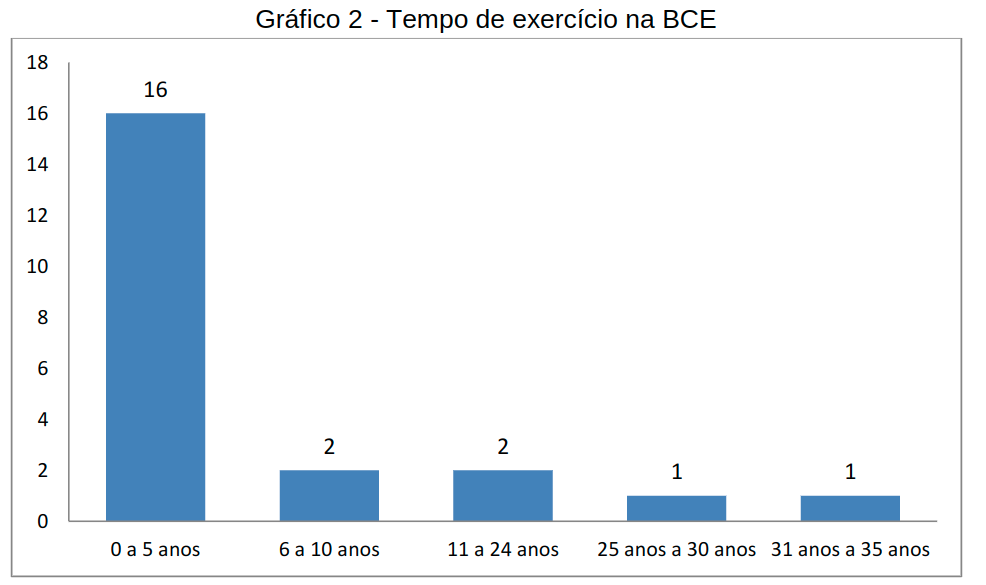
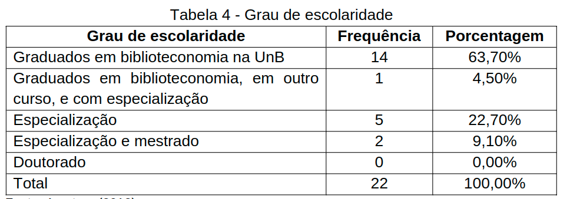

# Relatório de Pesquisa N° 8

| | |
|:-:| :-: |
| **Título:** | Princípios de marketing aplicados às unidades de informação : estudo de caso da Biblioteca Central da Universidade de Brasília |
| **Autor:** | STEPHANIE MOIRA BRAUNA DA ROCHA |
| **Tipo:** | Monografia de obtenção de bacharel em Biblioteconomia |
___
 

### **Objetivo da pesquisa**

Verificar   a   aplicabilidade   dos   princípios   de   marketing   em   bibliotecas universitárias.

Os objetivos específicos são:
* Compreender o processo de marketing a partir da sua evolução e conceituação.
* Levantar as razões para aplicação do marketing em bibliotecas bem como os obstáculos para sua adoção.
* Verificar as técnicas de marketing aplicáveis às bibliotecas.
* Propor técnicas de marketing para uso em bibliotecas universitárias.
* Diagnosticar a situação atual da Biblioteca Central da Universidade de Brasília, no que tange ao seu histórico, estrutura organizacional, recursos disponíveise resultados.
* Verificar o entendimento e interesse dosbibliotecários da Biblioteca Central daUniversidade de Brasíliapelo marketing.

### **Metodologia**

A pesquisa exploratória teve como instrumento um questionário aplicado a um grupo de bibliotecários da Biblioteca Central da UnB, visando analisar seu conhecimento e interesse pelo marketing em unidades de informação, especificamente na BCE. O questionário é de caráter quantitativo e qualitativo, pois é composto por perguntas abertas e fechadas

### **Informações Relevantes**

#### Estrutura organizacional
Atualmente a estrutura organizacional da biblioteca é composta por cinco tipos de serviços subdivididos em 11 seções, subordinados a uma Diretoria, conforme mostra Figura 4:

  

#### Recursos humanos

A BCE conta com 250 funcionários, sendo:
* 45 bibliotecários;
* 97 estagiários da graduação e estagiários técnicos;
* Sete bolsistas da Diretoria de Desenvolvimento Social(DDS-UnB);
* 29 terceirizados, sendo 19 do serviço de limpeza;
* 72 servidores envolvidos em diversas atividades.

#### Recursos informacionais

A biblioteca possui um acervo aproximado de um milhão e meio de exemplares, incluindo as 9760 aquisições do ano de 2011. O acervo é formado por diversos tipos de formato e suporte, como: livros e material de referência, periódicos, obras raras, coleções especiais, microformas, gravações de vídeo, discos de vinil, partituras, atlas, mapas, entre outros. Além do acervo físico, por meio do site da BCE é possível o usuário ter acesso ao catálogo em linha, as diversas bases de dados, como CAPES, Ebrary e ProQuest, Repositório Institucional, Biblioteca Digital de Teses e Dissertações, Biblioteca Digital de Monografias, entre outros.

#### Recursos materiais

A Biblioteca Central possui 186 cabines de estudo individual, 461 mesas e 2079 cadeirasaos usuários, distribuídas entre os três andares da biblioteca. São disponibilizados 110 computadores aos usuários, instalados no Laboratório de Acesso Digital (LAD) e no Auditório, usados em treinamentos, e para os usuários terem acesso à internet, além da consulta ao catálogo. Alguns computadores estão em terminais próximos ao serviço de empréstimo para consulta ao catálogo online.

#### Recursos tecnológicos

Além dos computadores, os usuários contam com acesso a rede sem fio própria da biblioteca, em que os usuários podem utilizar sem a necessidade de logincom a matrícula da UnB e senha, como na UnB wireless. A biblioteca possui o Serviço de Gerenciamento de Informação Digital (GID), que gerencia a informação em meio digital e coordena as Bibliotecas Digitais existentes na Universidade de Brasília. Os recursos tecnológicos para gestão da informação são: Pergamum, Dspacee SEER, como explicitado anteriormente. O Núcleo de Informática e Tecnologia (NIT) é o setor responsável pelo gerenciamento dos recursos tecnológicos. Entre suas atividades está o estudo adequado das ferramentas de informática para serem utilizadas nos serviços desenvolvidos pela biblioteca.

#### Recursos financeiros

Segundo dados da Diretoria de Orçamento da UnB (DOR), a verba de 2012 destinada à compra de acervo bibliográfico para a BCE é de R$ 830.000, dos quais são 
R$ 450.000 do Tesouro Direto e R$ 430.000 advindosda FAI (Fundo de Apoio Institucional). O FAI é composto pelas arrecadações da UnB, como CESPE (Centro de Seleção e de Promoção de Eventos - UnB) e aluguel de imóveis da universidade. A BCE recebe R$ 121.000 do Plano de Desenvolvimento Institucional (PDI) para gastos com a própria biblioteca. Esta verba pode ser gasta com cursos de capacitação de pessoal e materiais de expediente, bem como equipamentos, como impressoras e computadores. A média das multas pagas pelos usuários no atraso da devolução de materiais é R$ 80.000 a R$ 100.000 por ano. O valor pode variar em decorrência das greves na UnB ou outros fatores imprevisíveis. O valor dessas multas é gasto com melhorias para a biblioteca, como despesas com manutenção e compra de novas estantes.

#### Serviços e produtos

A biblioteca funciona de segunda a sexta, das 7h às 23:45h e aos sábados, domingos e feriados das 8h às 17:45h. O serviço de empréstimo é restrito aos usuários cadastrados, que devem ser alunos, ex-alunos da UnB, docentes e servidores. Além do empréstimo, é possível fazer renovação e reserva de materiais.

O prazo e a quantidade de documentos a serem emprestados variam de acordo com a categoria de usuário e com as normas específicas do setor responsável por aquele acervo. Se a devolução do material for realizada fora do prazoestipulado, é cobrada uma multa, calculada por dia de atraso para cada obra ou serviço.

Os serviços ofertados são:
* Serviço de empréstimo semestral para o corpo docente da universidade
* Serviço de empréstimo entre bibliotecas, mediante o Termo de Adesão e Compromisso, disponibilizado no site da BCE;
* Recebimento de doações, desde que se enquadrem nas orientações para recebimento de doações explicitadas no site;
* Serviço de elaboração de fichas catalográficas de dissertações de mestrado e teses de doutorado defendidas na UnB;
* Serviço de Comutação Bibliográfica (COMUT), que permite obter de outras bibliotecas cópias de artigos de periódicos, teses, dissertações e anais de congressos não existentes no acervo da BCE. Este serviço pode ser usado por toda a comunidade interna e externa àUnB;
* Serviço de referência e de atendimento ao usuário, por meio do auxílio e pesquisa documental em bases de dados;
* Acesso às 13 bases de dados disponíveis, desde que o acesso seja feito por meio de computadores conectados a Rede da UnB, ou no cadastro do Centro de Processamento de Dados (CPD), para uso em computadores pessoais;
* Treinamento aos usuários sobre o uso de bases de dados;
* Auxílio sobre a utilização das normas da Associação Brasileira de Normas Técnicas (ABNT) e outras normas bibliográficas;
* Visitas orientadas;
* Disseminação seletiva da informação.

Os produtos disponibilizados são:

* Biblioteca Digital de Teses e Dissertações;
* Biblioteca Digital e Sonora (BDS), para atender a demanda dos deficientes visuais da UnB e da comunidade em geral, por meio da organização e armazenamento de materiais em formato digital;
* Repositório Institucional, que é composto pela produção científica e acadêmica da Universidade de Brasília;
* Biblioteca Digital de Monografias de Graduação e Especialização (BDM);
* Diretório de Periódicos Acadêmicos, que reúne em um único site os periódicos acadêmicos da UnB que se adequam aos critérios pré-estabelecidos;
* LE UnB – Livros eletrônicos da UnB, biblioteca digital destinada à publicação de livros eletrônicos produzidos na UnB;
* Siteda Biblioteca Central, onde é possível encontrar informações sobre o acervo, serviços e outros produtos da biblioteca;
* Tradutor onlineintegrado ao site da BCE;
* Catálogo online, que permite busca avançada por autor, título, tipode obra, coleção ou biblioteca;
* Lista de duplicatas disponível no site;
* Mural denovas aquisições da biblioteca

#### Usuários cadastrados

Constam  no  cadastro  da  BCE  22574  usuários,  distribuídos  nas  seguintes categorias:
* Alunos de graduação: 12197
* Alunos da pós-graduação: 1728
* Servidores: 1326
* Professores: 3523
* Ex-alunos: 3080

#### Estratégias de marketing

Atualmente, a principal estratégia de marketing da BCE é o site. O site é composto por informações sobre a bibliotecae seu funcionamento, e-mails e telefones de contato, notícias e destaques, como lançamentos de livros e acesso aos produtos e serviços da BCE.

O design é composto basicamente pelas cores branca e verde, se remetendo as cores do logotipo da UnB. Os links que estão centralizados e são visualizados logo ao abrir a página são: acesso ao catálogo, renovação de livros, solicitação de compra (onde o usuário pode sugerir livros para aquisição) e pesquisa integrada.

O link de acesso à pesquisa integrada foi adicionado em maio de 2012, visando facilitar a busca. Invés de pesquisar em cada repositório separadamente, o usuário faz uma busca integrada, que abrange todos os repositórios e bibliotecas digitais da BCE. O software utilizado é o Summon, uma divisão da ProQuest, que permite também uma busca refinada e preenchimento de formulário de feedbacksobre satisfação e se o usuário indicaria o serviço de busca à alguém.

As últimas notícias e destaques estão posicionados logo abaixo dos links descritos anteriormente. Na coluna esquerda encontram-se os links das informações, serviços e produtos, e acesso ao usuário. Na coluna direita estão os ícones e links das redes sociais que a BCE é ativa, os ícones dos serviços e produtos e o tradutor on-line. 

O maior benefício do site é disponibilizar de maneira ampla as informações, produtos e serviços que a BCE possui. No entanto, a navegação torna-se difícil pela fonte pequena e disposição inadequada dos elementos que o compõe. O desperdício de espaço é percebido ao observar as colunas laterais: tanto na coluna esquerda, quanto na coluna direita há o acesso para os mesmos serviços e produtos. A diferença é que na coluna esquerda o acesso é por meio de linkse na coluna direita por meio de ícones. É interessante que o espaço seja aproveitado da melhor forma, possibilitando melhor visualização e navegação nos recursos disponíveis. A BCE está planejando um novo site, mas ainda não há informações divulgadas a respeito

## Coleta de dados

O  universo da pesquisa é constituído pelos 45 bibliotecários que são servidores da UnB e estão lotados nos diversos setores da Biblioteca Central, e pelosbibliotecários que foram admitidos por análise de currículo ou indicação.

A amostra é composta por 12 bibliotecários admitidos por concurso e por 10 bibliotecários admitidos por análise de currículo ou indicação.

Quanto à idade, a maioria (68,20%) possui entre 20 e 30 anos, seguidos pelos que possuem entre 41 a 50 anos (18,20%), de acordo com o Gráfico 1:

  

A  Tabela  3demonstra  que  a  maioria  é  do  sexo  feminino  (77,30%)  e  apenas (22,70%) é do sexo masculino

  

A respeito do tempo de exercício profissional na BCE, constata-se que a maior parte dos respondentes (72,80%) tem no máximo 5 anos de serviço, conforme Gráfico 2

  

Em relação ao grau de escolaridade, grande parte dos bibliotecários são graduados em biblioteconomia na UnB (63,70%); 1 bibliotecário (4,50%) égraduado em biblioteconomia e em letras e possui especialização em gestão da informação; 5 bibliotecários (22,70%) possuem especialização nas áreas de gestão universitária, gestão da informação, conservação e restauração de documentos, preservação digitale biblioteconomia; 2 bibliotecários (9,10%) possuem especialização (1 na área de biblioteconomia e 1 em marketing da informação) e mestrado em ciência da informação, de acordo com a Tabela 4:

  

Quando perguntado quais seriam as principais dificuldades na implementação de estratégias de marketing no âmbito da BCE, 28.90% dos entrevistados apontou a limitação de recursos financerios, 26.70% número insuficiente de pessoal e 20% despreparo da equipe.

| Dificuldades para uso de estratégias de marketing na BCE | Frequência | Porcentagem |
| :------------------------------------------------------: | :--------: | :---------: |
| Limitação de recursos financeiros. | 13 | 28.90% | 
| Número insuficiente de pessoal.| 12| 26.70% | 
| Despreparo do pessoal. | 9 | 20.00% | 
| Falta de apoio da administração superior. | 6 | 13.30% | 
| Instalações inadequadas para o funcionamento da biblioteca. | 3 | 6.70% |
| Falta de equipamentos. | 2 | 4.40% |
| **Total** | **45** | **100%**  |

#### Estratégias de marketing mais eficientes que estão sendo utilizadas pela BCE

Das estratégias de marketing que estão sendo utilizadas pela BCE são consideradas mais eficientes, 28.84% apontaram o site da BCE, 15.40% apontaram para o as bases de dados e 11.53% apontaram o catálogo online de obras.

| Estratégias de marketing mais eficiente | Frequência | Porcentagem |
| :-------------------------------------: | :--------: | :---------: |
| Site da BCE | 15 | 28.84% | 
| Bases de dados | 8 | 15.40% | 
| Catálogo online | 8 | 15.40% | 
| Folder | 6 | 11.53% | 
| Repositório Institucional | 6 | 11.53% | 
| Biblioteca Digital de Teses e Dissertações | 3 | 5.77% | 
| COMUT | 3 | 5.77% | 
| Biblioteca Digital e Sonora | 2 | 3.84% |
| Biblioteca Digital de Monografias | 1 | 1.92% |
| **Total** | **52** | **100%**  |

Quando perguntado quais novas estratégias podiam ser usadas, as seguintes estratégias foram citadas:

* Utilização de forma mais frequente dotwitterda BCE.
* Realização  de  exposições  sobre  os  processos  executados  em  cada  um  dos setores  da  BCE,  tais  como:  setor  de  seleção  e  aquisição,  processamento técnico, restauração e obras raras.
* Desenvolvimento  de  programas  de  letramento  informacional  e  alfabetização digital juntamente com os departamentos, levando a um maior contato com os usuários.
* Campanhas  educativas  por  meio  da  divulgação  dos  serviços  e  produtos  da BCE em eventos da UnB.
* Telões  em  locais  visíveis  da  universidade,  contendo  informações  básicas  e importantes sobre a BCE, seus serviços e produtos.
* Elaboração de um "guia do usuário" da BCE em formato impresso e digital.
* Criação  e  inclusão  de  um  guia  sobre  os  serviços  e  produtosda  BCE  no  kit que os calouros ganham ao entrar na UnB, no 1° semestre de curso.
* Ampliação  da  divulgação  dos  produtos  e  serviços  oferecidos  pela  BCE diretamente nos departamentos, institutos e faculdades da UnB

## Conclusões

Foi notório que os bibliotecários pesquisados conhecem sobre o marketing e seus benefícios e atribuem uma grande importância a sua utilização na BCE. Observou-se que muitos autores, inclusive bibliotecários são reconhecidos por enfatizarem sobre o marketing e sua abordagem em unidades de informação.

Metade dos bibliotecários que participaram da pesquisa sugeriram estratégias de marketing para BCE, o que demonstra que há interesseem aprimorar as estratégias existentes. No entanto, as limitações e dificuldades encontradas, tais como limitação de recursos financeirose número insuficiente de pessoal, traz desmotivação e têm feito com que o conhecimento e o interesse sejam utilizados parcialmente.

## REFERÊNCIAS

Rocha, Stephanie Moira Brauna da. Princípios de marketing aplicados às unidades de informação: estudo de caso da Biblioteca Central da Universidade de Brasília / Stephanie Moira Brauna da Rocha. – 2012