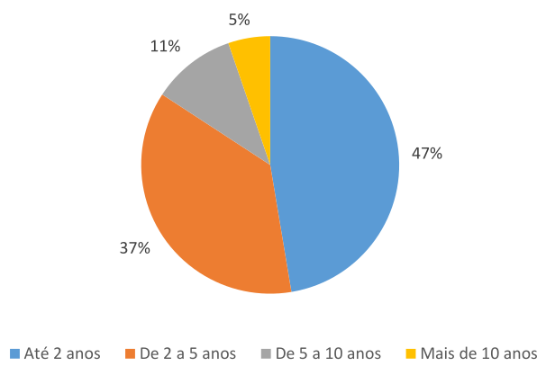
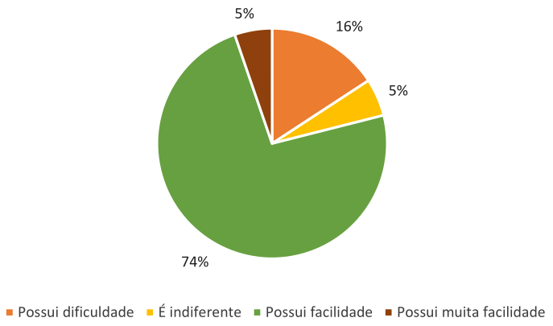
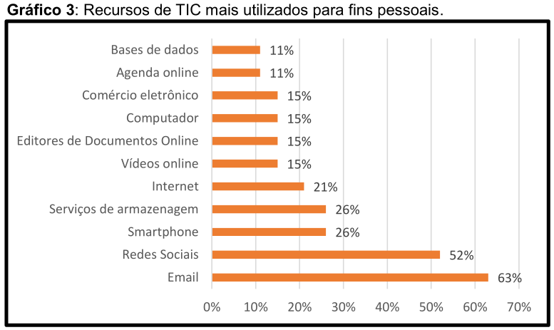
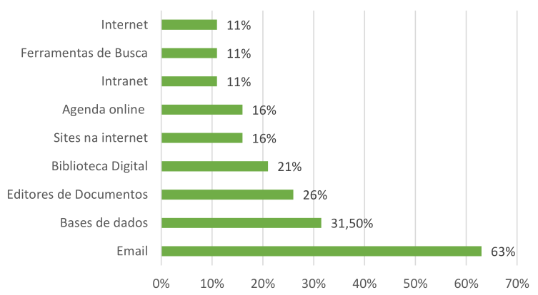
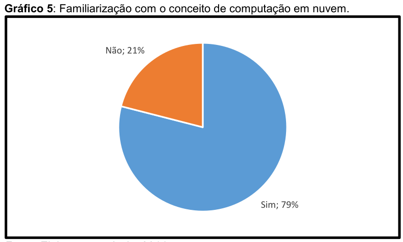
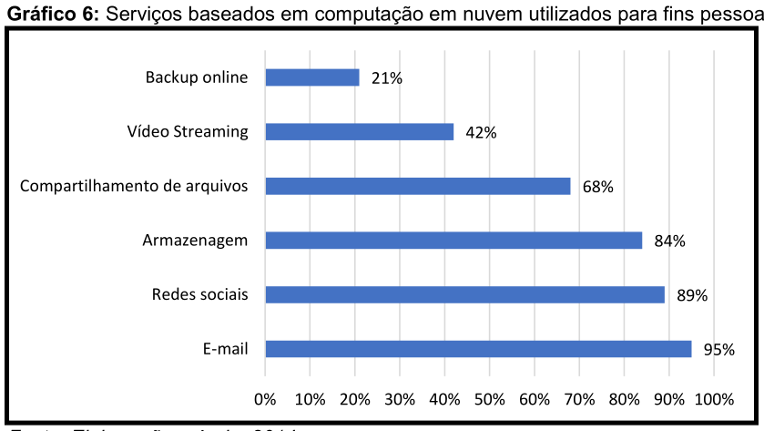
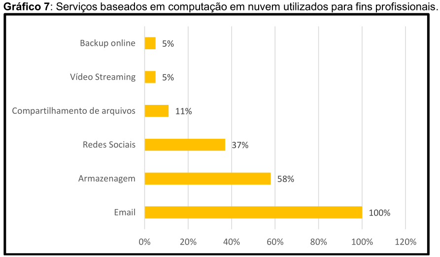
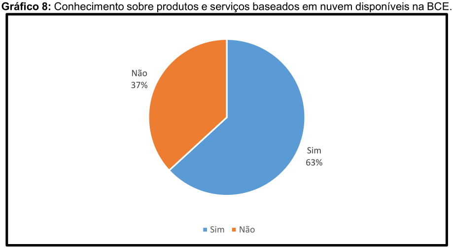
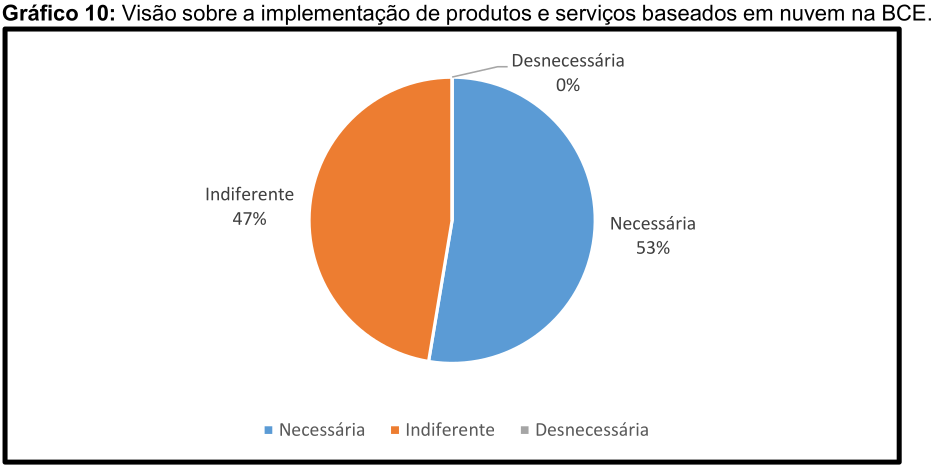

# Relatório de Pesquisa N° 1

| | |
|:-:| :-: |
| **Título:** | COMPUTAÇÃO EM NUVEM: estudo sobre o uso e implementação na visão dos bibliotecários da BCE/UnB |
| **Autor:** | GESSYCA DA SILVA LAGO |
| **Tipo:** | Monografia de obtenção de bacharel em Biblioteconomia |
___
 

### **Objetivo da pesquisa**

Analisar a visão dos bibliotecários da BCE/UnB sobre o uso e
implementação de serviços de computação em nuvem em sua biblioteca.

### **Metodologia**

Pesquisa exploratória com a abordagem de coleta de dados quantitativa. 

Utilização de questionário com 12 perguntas, sendo oito de múltipla escolha e quatro abertas (subjetivas).

### **Amostragem**

O questionário foi respondido por 19 bibliotecários. Alguns perfis de bibliotecários foram identificados: 
- Auxílio ao Usuário
- Gerenciamento da Informação Digital (GID) 
- Referência
- Processos Técnicos.

#### Pergunta 1:
Pretendia saber a quanto tempo o respondente exercia a função atualmente ocupada na BCE

* 47% até 2 anos
* 37% ade 2 a 5 anos
* 11% de 5 a 10 anos
* 5% mais de 10 anos

  

#### Pergunta 2:
Pretendia avaliar como os bibliotecários percebiam suas habilidades e conhecimentos sobre as Tecnologia da Informação e Comunicação (TIC)

* 74% alguma facilidade
* 16% possui dificuldade
* 5% muita facilidade
* 5% indiferente

  

#### Pergunta 3:
Pergunta de natureza aberta, onde foi perguntado quais ferramentas de TIC utilizam em suas atividades pessoais.

* 63% email
* 52% redes sociais
* 26% smartphone
* 26% serviço de armazenagem
* 21% internet
* 15% vídeo online 
* 15% editores de documento online
* 15% computador
* 15% comércio eletrônico
* 11% agenda online
* 11% base de dados

  

#### Pergunta 4:
Pergunta de natureza aberta, onde foi perguntado quais recursos de TIC os respondentes fazem uso nas atividades proficionais.

* 63% email
* 31.50% base de dados
* 26% editores de documento
* 21% biblioteca digital
* 16% sites nas internet
* 16% agenda online
* 11% intranet
* 11% ferramenta de busca
* 11% internet

  

#### Pergunta 5:
Pergunta de natureza objetiva, pretendia verificar o grau de familiarização dos pesquisados com computação em núvem. 

* 79% SIM
* 21% NÃO

  

#### Pergunta 6:
Pergunta de natureza objetiva, os respondentes deveriam marcar entre os serviços baseados em núvem listados, quais eram utilizados para fins pessoais.

* 95% email
* 89% redes sociais
* 84% armazenagem
* 68% compartilhamento de arquivos
* 42% video streaming
* 21% backup online

  

#### Pergunta 7:
Pergunta de natureza objetiva, os respondentes deveriam marcar entre os serviços baseados em núvem listados, quais eram utilizados para fins profissionais.

* 100% email
* 58% armazenagem
* 37% redes sociais
* 11% compartilhamento de arquivos
* 5% video streaming
* 5% backup online

  

#### Pergunta 8:
Pergunta de natureza objetiva, foi perguntado se os entrevistados tinham conhecimento dos serviços ofertados pela BCE que tinham sua infraestrutura na núvem.

* 63% tinham conhecimento
* 37% não tinham conhecimento

  

#### Pergunta 9:
Pergunta de natureza objetiva, foi perguntado qual era a visão dos entrevistados a respeito da implementação de serviços da BCE com infraestrutura na núvem.

* 53% julgam necessário
* 47% indiferente
* 0% desnecessário

  

## Conclusões

Através da análise dos dados foi possível observar que a maior parte dos bibliotecários da BCE declaram conhecer as Tecnologias de Informação e Comunicação (TIC) e ter noção do conceito de computação em núvem. Os bibliotecários pesquisados utilizam as tecnologias, tanto na esfera pessoal, como profissional. 

## REFERÊNCIAS

Lago, Gessyca Lago Computação em nuvem: estudo sobre o uso e implementação na visão dos bibliotecários da BCE/UnB/Gessyca da Silva Lago. – 2014.