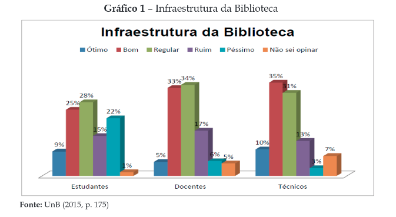
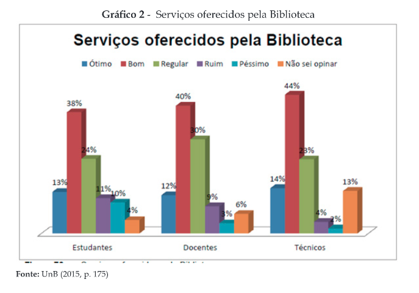
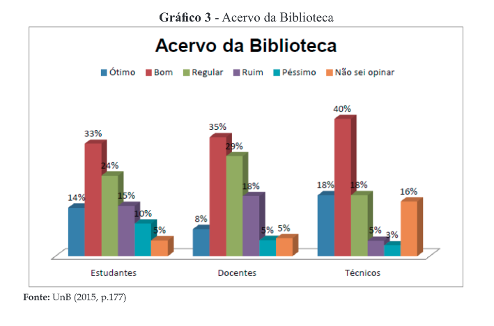

# Relatório de Pesquisa N° 13

| | |
|:-:| :-: |
| **Título:** | BIBLIOTECA UNIVERSITÁRIA E OS INDICADORES DO SINAES: estudo do caso da Universidade de Brasília |
| **Autor:** | Flor de María Silvestre Estela e Murilo Bastos da Cunha |
| **Tipo:** | Relato de Pesquisa |
___
 

### **Objetivo da pesquisa**

Analisar a visão dos bibliotecários da BCE/UnB sobre o uso e implementação de serviços de computação em nuvem em sua biblioteca.

### **Metodologia**

A metodologia adotada neste trabalho foi a análise documentária a partir de fontes de informações, documentos da Universidade de Brasília(UnB) e das publicações geradas pela Comissão própria de Avaliação, no período 2014, para dar resposta às dimensões dos instrumentos de avaliação do SINAES, a saber: instalações físicas; instalações para o acervo e funcionamento; informatização.

### **Amostragem**

A comunidade universitária foi consultada acerca da infraestrutura da UnB. No total, foram dezoito quesitos relacionados a instalações físicas, biblioteca, espaços para lazer e atendimento, recursos de tecnologia, entre outros, que professores, técnicos e alunos puderam avaliar e sugerir melhorias. No entanto não foi especificado no artigo o número exato de participantes.

#### Pergunta 1:
Pretendia avaliar como os estudantes, docentes e técnicos avaliavam a infraestrutura da biblioteca

  

  Entre os alunos

  * 9% Consideram ótimo
  * 25% Consideram bom
  * 28% Consideram regular
  * 15% Consideram ruim
  * 22% Consideram péssimo
  * 1% Não souberam opinar
  

  

  Entre os docentes

  * 5% consideram ótimo
  * 33% Consideram bom
  * 34% Consideram regular
  * 17% Consideram ruim
  * 6% Consideram péssimo
  * 5% Não souberam opinar
  

  

  Entre os técnicos

  * 10% consideram ótimo
  * 35% Consideram bom
  * 31% Consideram regular
  * 13% Consideram ruim
  * 3% Consideram péssimo
  * 7% Não souberam opinar
  

  

#### Pergunta 2:
Pretendia avaliar a qualidade do serviços oferecidos pela biblioteca de acordo com os estudantes, docentes e técnicos.

  

  Entre os alunos

  * 13% Consideram ótimo
  * 38% Consideram bom
  * 24% Consideram regular
  * 11% Consideram ruim
  * 10% Consideram péssimo
  * 4% Não souberam opinar
  

  

  Entre os docentes

  * 12% consideram ótimo
  * 40% Consideram bom
  * 30% Consideram regular
  * 9% Consideram ruim
  * 3% Consideram péssimo
  * 6% Não souberam opinar
  

  

  Entre os técnicos

  * 14% consideram ótimo
  * 44% Consideram bom
  * 23% Consideram regular
  * 14% Consideram ruim
  * 2% Consideram péssimo
  * 13% Não souberam opinar
  

  

#### Pergunta 3:
Pretendia avaliar a qualidade do acervo da biblioteca de acordo com os estudantes, docentes e técnicos.

  

  Entre os alunos

  * 14% Consideram ótimo
  * 33% Consideram bom
  * 24% Consideram regular
  * 15% Consideram ruim
  * 10% Consideram péssimo
  * 5% Não souberam opinar
  

  

  Entre os docentes

  * 8% consideram ótimo
  * 35% Consideram bom
  * 29% Consideram regular
  * 18% Consideram ruim
  * 5% Consideram péssimo
  * 5% Não souberam opinar
  

  

  Entre os técnicos

  * 18% consideram ótimo
  * 40% Consideram bom
  * 18% Consideram regular
  * 5% Consideram ruim
  * 3% Consideram péssimo
  * 16% Não souberam opinar
  

  

#### Pergunta 4:
Pretendia avaliar como era considerado o acesso à bibliografia das disciplinas por meio da biblioteca de acordo com os estudantes:

* 26% Consideram excelente
* 4% Consideram bom
* 25% Consideram regular
* 10% Consideram ruim
* 4% Consideram insuficiente

  

## Conclusões

Os resultados mostram que para os itens de serviços oferecidos, acervo e acesso a bibliografia das disclinas em bibliotecas da UnB quase que para todos os casos foi avaliado como ótimo/excelente ou bom pela maioria das pessoas que foram consultadas, já os resultados do item infraestrutura, serviços e coleções da BCE/UnB, os usuários a avaliam como regular ou pior do que isso em sua maioria, não contribuindo assim mais fortemente na promoção da pesquisa, ensino e extensão.

## REFERÊNCIAS

Estela e Cunha, Flor de María Silvestre Estela e Murilo Bastos da Cunha. BIBLIOTECA UNIVERSITÁRIA E OS INDICADORES DO SINAES: estudo do caso da Universidade de Brasília. – 2017.
