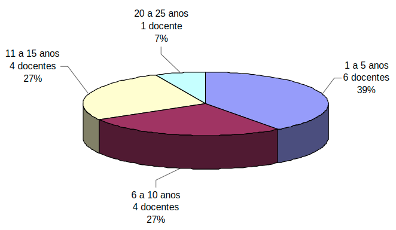
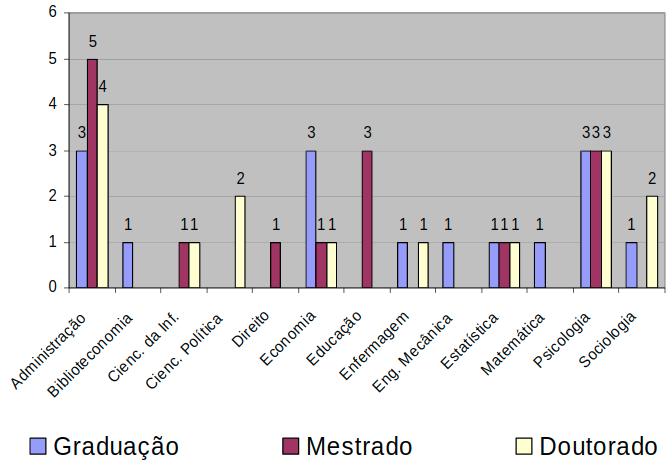
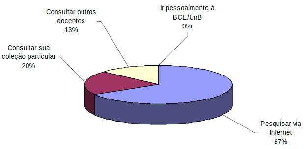
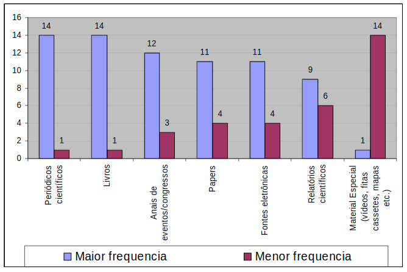
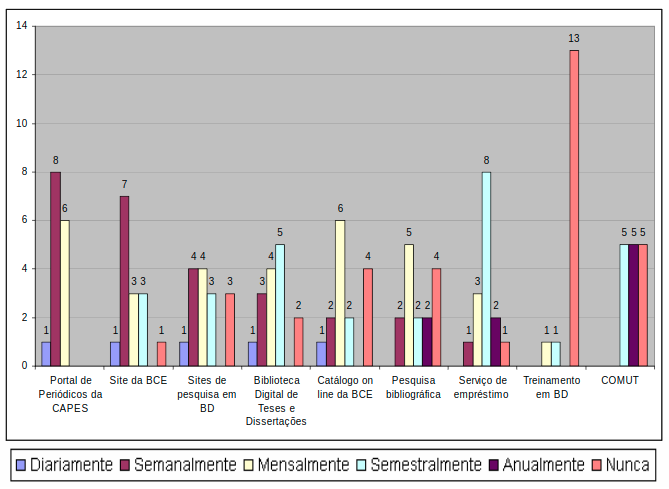
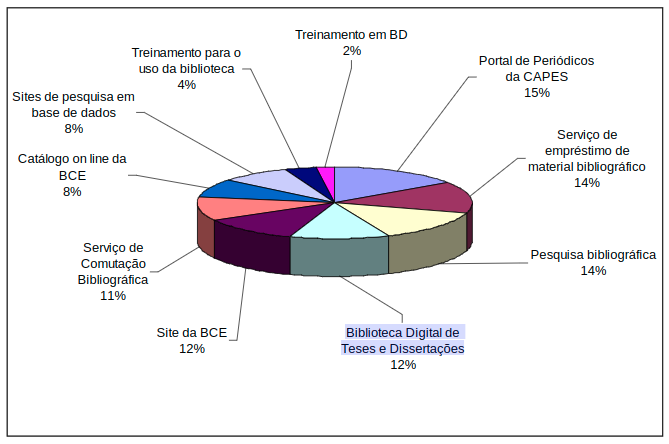
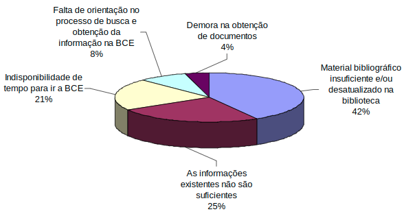
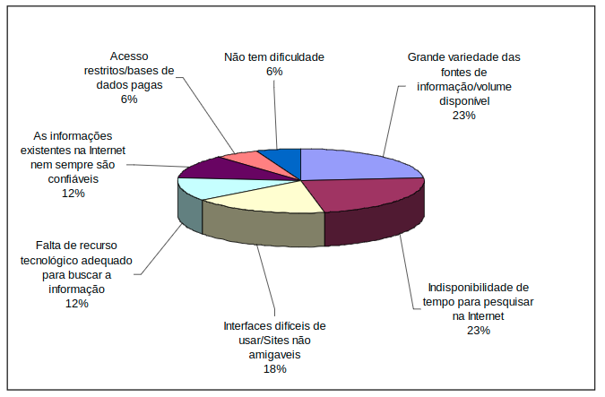
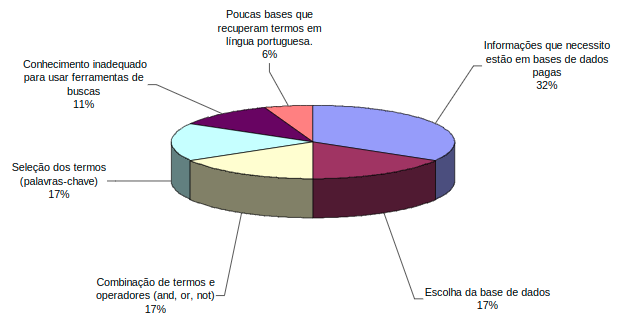

# Relatório de Pesquisa N° 5

| | |
|:-:| :-: |
| **Título:** | Comportamento dos docentes do Programa de Pós-Graduação em Administração (PPGA) da Universidade de Brasília na busca e uso da informação |
| **Autor:** | JANNE CURY NASSER & JEFFERSON HIGINO DANTAS |
| **Tipo:** | Monografia de obtenção de Pós Graduação  em  Administração  |
___
 

### **Objetivo da pesquisa**

O  objetivo  geral  da  pesquisa  é  verificar  o  comportamento  dos  docentes  do  Programa de Pós-Graduação em Administração (PPGA) da Faculdade de Economia, Administração,  Contabilidade  e  Ciência  da  Informação  e  Documentação  (FACE)  da  Universidade  de  Brasília  (UnB)  no  processo  de  busca  e  uso  da  informação  para  realizar suas atividades acadêmicas. 

Os objetivos específicos são:
* Caracterizar o perfil dos docentes do PPGA/FACE/UnB; 
* Identificar a oferta de serviços da BCE; 
* Analisar o comportamento dos docentes do PPGA/UnB em relação a: 
> * a) aquisição  de  novos  conhecimentos  sobre  os  assuntos  referentes  a  sua  área de atuação; 
> * b)  os  tipos  de  fontes  de  informação  (periódicos,  anais,  livros,  conteúdos  em  formato eletrônico) ; 
> * c)  uso  dos  serviços  oferecidos  pela  Biblioteca  Central  da  Universidade  de  Brasília ; 
> * d) Dificuldades enfrentadas no processo de busca e uso da informação;
> * e)  Preferência  na  busca  de  informações  necessárias  á  realização    das  atividades acadêmicas;
> * f) Indicação dos serviços da BCE aos alunos;
> * g)  Grau  de  satisfação  dos  docentes  em  relação  aos  resultados  obtidos  em  suas próprias buscas. 

### **Metodologia**

Para alcançar os objetivos deste trabalho foi realizada uma pesquisa descritiva. A pesquisa é censitária,uma vez que serão pesquisados todos os docentes do PPGA, totalizando 20 professores, segundo consulta ao site da PPGA da Universidade de Brasília.

### **Amostragem**

Na análise de tempo de docência dos entrevistados mostrou que a 39% dos docentes tinham de 1 a 5 anos de docência, 27% tinham de 6 a 10 anos de docência, 27% de 11 a 15 anos de docência e somente 7% tinham mais de 20 anos de docência.

  

Na análise do grau acadêmico da formação dos docentes por área de conhecimento, a seguinte distribuição foi encontrada. 46% seram professores das ciências sociais, 26% das ciências exatas, 13% das ciẽncias da saúde. 

  

Na análise de qual é a preferência dos docentes na busca por informação, 67% prefere buscas abertas na internet, 20% buscas em coleções particulares (base de dados), 13% consulta com outros docentes. 

  

Na análise de qual frequência era feita a consulta de diversos tipos de materiais, as seguintes distribuição foi encontrada.

  

Na análise do uso dos serviços oferecidos pela BCE/UNB, foi evidenciado a seguinte distribuição:

  

Na análise dos serviços indicados pelos docentes aos seus alunos, a pesquisa no Portal de Periódicos da CAPES ficou primeiro lugar com 15% das recomendações, seguido por sites de pesquisa em base ded dados com 14%, em terceiro lugar ficou o site Biblioteca Digital de Teses e Dissertações com 12% das indicações. 

  

Na análise de quais eram as dificuldades encontradas durante a realização de pesquisas na BCE/UNB, os seguintes tópicos foram destaque:

  

Na análise de quais eram as principais barreiras que o docente encontrava para pesquisar na internet, os seguintes tópicos destacaram:

  

Na análise das principais dificuldades no uso das bases de dados, os seguintes tópicos de destacaram:

  

## Conclusões

Com os resultados da pesquisa foi possível concluir que:
* A maior  parte  dos docentes utiliza de meios semiformais para divulgação de sua produção cientifica.
* Dentre os serviços ofertados pela BCE, os serviços oferecidos via rede são os mais usados.
* Há uma carência de treinamento dos docentes para utilizar os serviços da BCE
* Ficou  evidenciada  a  preferência  dos  docentes  pelas  informações  em  formato  eletrônico,  em  detrimento  dos materiais impressos.

## REFERÊNCIAS

NASSER, JANNE CURY; DANTAS, JEFFERSON HIGINO. Comportamento dos docentes do Programa de Pós-Graduação em Administração (PPGA) da Universidade de Brasília na busca e uso da informação, 2007.