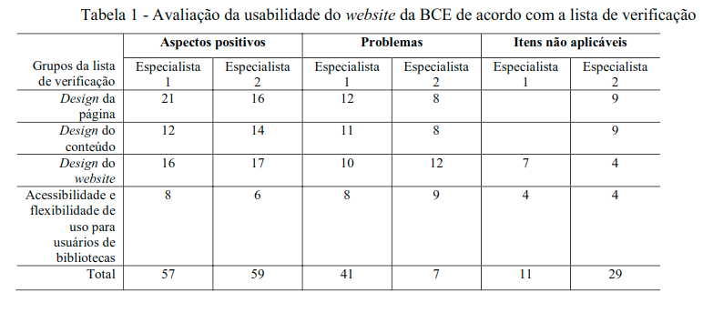
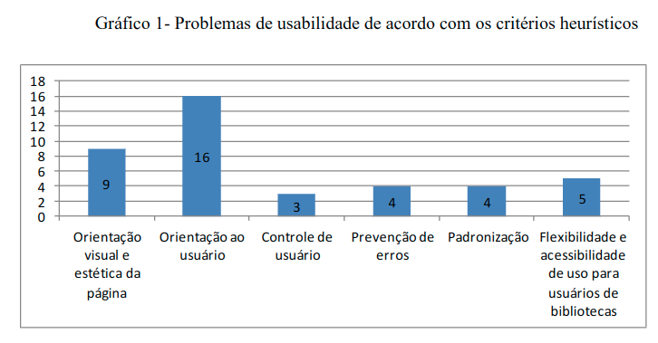

# Relatório de Pesquisa N° 6

| | |
|:-:| :-: |
| **Título:** | AVALIAÇÃO DE USABILIDADE DE WEBSITES INTEGRANDO GESTORES, DESENVOLVEDORES E USUÁRIOS |
| **Autor:** | Sueli Angélica do Amaral & Jose Antonio Machado Nascimento |
| **Tipo:** | Artigo publicado no XIV Encontro Nacional de Pesquisa em Ciência da Informação (ENANCIB 2013) |
___
 

### **Objetivo da pesquisa**

Verificar a usabilidade do website da Biblioteca Central da Universidade  de  Brasília,  sob  o  ponto  de  vista  de  gestores,  desenvolvedores  e  usuários.

### **Metodologia**

Foram realizadas  análise  do  contexto  de  uso  do website com  seus  gestores  e  desenvolvedores,  por meio  de  análise  documental,  entrevista  com  verbalização  estimulada  e  ficha  de  observação; avaliação  ergonômica  de  suas  interfaces  com  lista  de  verificação,  guia  de  recomendações  e avaliação heurística; descrição do modelo mental dos usuários relativo à arvore semântica do website por meio de ensaio de interação com a técnica card sorting e identificação dos erros cometidos pelos usuários no uso do website, por meio de ensaio de interação com a técnicade análise  da  tarefa.

### Dados

Na avaliação de usabilidade do website da BCE, de acordo com a lista de verificação, as seguintes categorias foram marcadas:

  

Na avaliação de usabilidade do website da BCE, de acordo com os critérios heurísticos, os seguintes problemas foram identificados:

  

## Conclusões

Constatou-se  que  os  gestores  e  os  desenvolvedores  desconsideravam  a participação   do   usuário,   desconheciam   os   benefícios   da   usabilidade   e   enfrentavam dificuldades gerenciais e tecnológicas. A estrutura do website não propiciava a realização das tarefas pelos usuários em tempo hábil, devido ao excesso e duplicidade de links.

Concluiu-se, que a reformulação do website deve privilegiar a criação de hipertextos e leiautes fluidos, que possibilitarão   modificações   constantes,   sem   necessariamente   alterar   a   linearidade   da navegação.

## REFERÊNCIAS

Amaral, Sueli Angélica do; Nascimento, Jose Antonio Machado. Avaliação de usabilidade de websites integrando gestores, desenvolvedores e usuários, XIV Encontro Nacional de Pesquisa em Ciência da Informação (ENANCIB 2013).